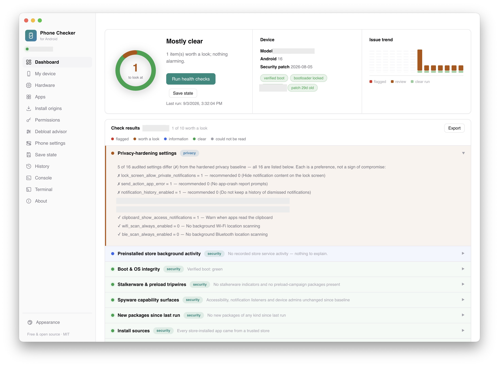
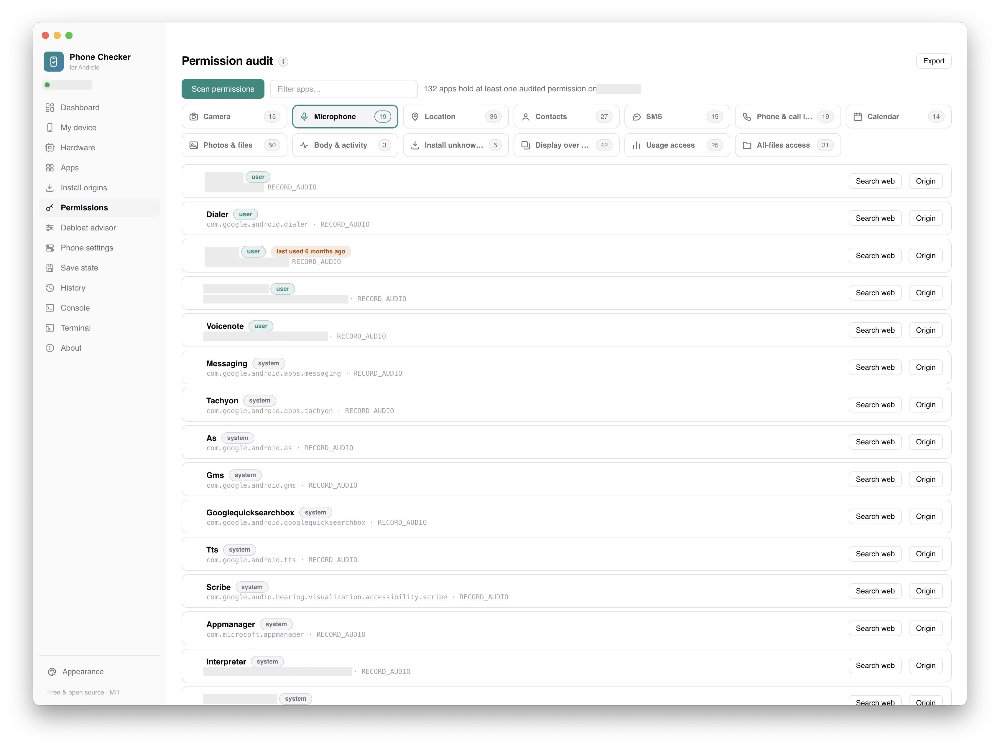
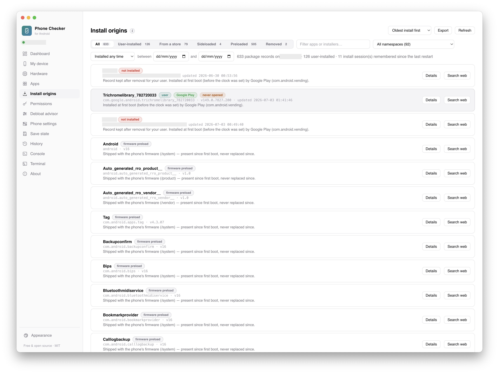
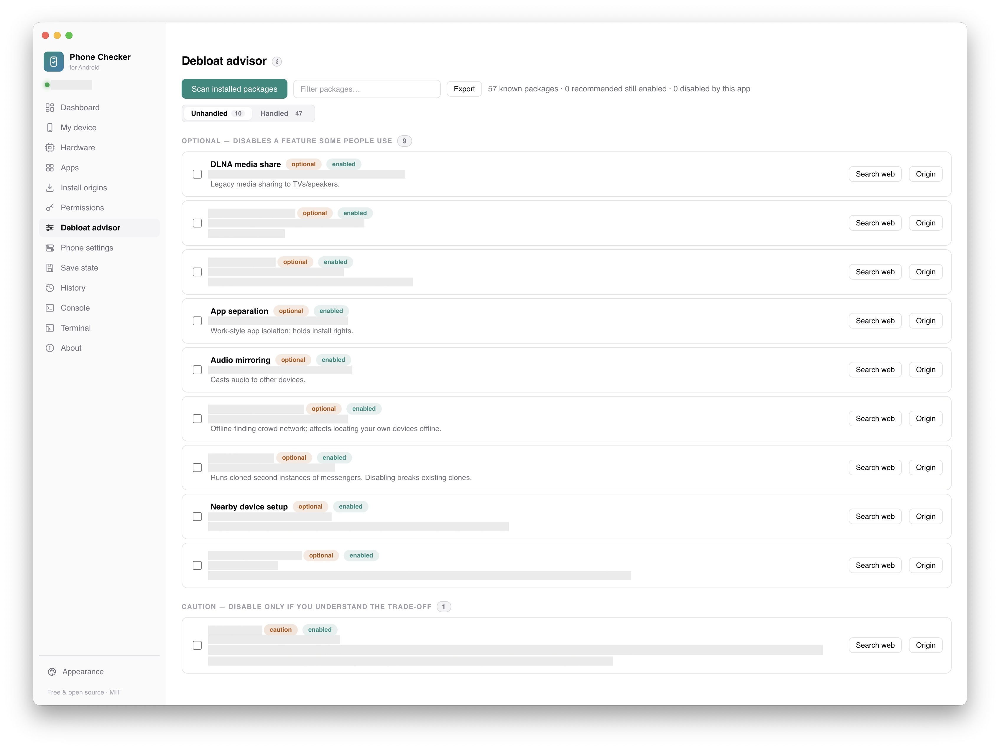
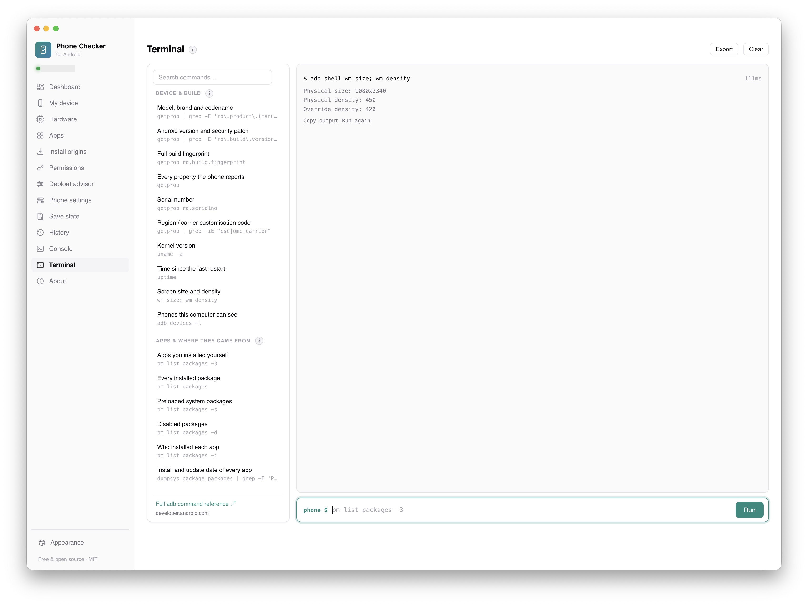

# Phone Checker for Android

Security and privacy health checks for your own Android phone, plus a sensible debloat advisor that explains what each package actually does before you touch it.

Phone Checker runs on your desktop (macOS, Windows, Linux) and communicates with your phone via standard ADB over a USB cable. **No root, no exploits, and nothing leaves your computer**: no telemetry, no accounts, and no remote servers.

> **A note on this project:** I built Phone Checker for my own phone and decided to share it openly under the MIT license. It's a finished personal project, provided as-is. You're welcome to download it, use it, and [fork it](#fork-it) to change or extend it however you like. Forking is the way to go: the repository doesn't take issues or pull requests.

---



## Why I built this

Phone Checker started with an unwelcome surprise on my own phone.

One day, I noticed apps I had never installed appearing on my device. Digging into it, I found the culprit: the manufacturer's preinstalled app store—running with deep system privileges—had silently downloaded and installed them in the background.

I spent weeks combing through package-manager dumps and system logs to piece together what had happened. What stuck with me was just how much rich data Android keeps about app origins, install sessions, and background activity—and how almost none of it is visible in your phone's standard Settings. And this isn't just one company's quirk; many Android manufacturers ship privileged stores and preload channels that operate behind the scenes.

I built Phone Checker to automate the ADB checks I was running by hand after every OS update. Once it worked, I figured other people who care about their device privacy would find it useful too. Anyone should be able to plug in their phone, see what's actually running, watch every command execute in real time, and decide for themselves what stays and what goes.

---

## Core Principles

- **Read-only by default:** Every health check, audit, and hardware inspection only reads data. The app will never modify your phone without you explicitly asking it to.
- **Consent-first changes:** When you do choose to make a change (like disabling a preinstalled app, tightening a setting, or adjusting a permission), you are shown the exact command first and must confirm it. High-risk actions and caution-tier packages require a second confirmation.
- **Always reversible:** Whenever you change a setting or disable an app, Phone Checker saves the previous state first. You can undo changes directly from the app's History view. *(The only exception is turning off USB debugging, which naturally closes the communication channel).*
- **100% local and private:** No accounts, no analytics, no cloud calls. The app makes no network requests of its own; the only time anything goes online is when you click a link or a "Search web" button, which opens in your own browser.
- **Documented commands only:** Everything goes through standard, official ADB commands available to normal users. See [COMMANDS.md](COMMANDS.md) for the complete list.
- **Vendor-neutral:** The checks work across Android devices. If a manufacturer ships proprietary preload channels, Phone Checker automatically loads a matching profile based on what the connected phone reports about itself.

---

## What it does

### Everyday Checks & Audits

- 🩺 **Health Checks (Read-Only):** 
  Scans for bootloader and OS integrity, stalkerware indicators, preload-vector tripwires, unexpected accessibility services, notification listeners, device administrators, unverified install sources, system-namespace masquerades, wireless debugging/VPN/proxy surfaces, active keyboards, and background activity timestamps from manufacturer stores.
- 🔄 **"What Changed?" Comparison:**
  Compare any two health-check runs side by side. Perfect for seeing which findings appeared, disappeared, or quietly changed before and after a system update.
- 📦 **Debloat Advisor:**
  Matches installed packages against a curated knowledge base written in plain language. Each entry explains what the package does, rates its safety tier (**Recommended**, **Optional**, **Caution**, or **Keep**), and includes a **Search web** button so you can double-check for yourself. "Keep"-tier packages known to break core functions (like camera or settings) can never be selected.
- 🔐 **Permission Audit:**
  See exactly which apps have access to your camera, microphone, location, SMS, contacts, call logs, calendar, photos/files, and sensors—including when sensitive permissions were last used. Distinguishes between granted permissions, "ask every time", platform defaults, and sleeping apps. Revoke or restore permissions with clear confirmation dialogs.
- 💾 **Save State & Snapshots:**
  Take a complete snapshot of your phone’s configuration (OS build, patch level, packages, versions, system settings, permissions, battery policies). Save a state before an update, take another after, and instantly see what preloaded junk the update switched back on. You can inspect the saved state right in the app down to raw JSON.

### Deeper Tools & Inspection

- 🔍 **Install Origins:**
  Reveals the hidden paper trail for every app on your phone: when it was installed, which app initiated the install, which installer was recorded (Google Play, manufacturer store, APK installer, ADB, or preload), and whether it came preloaded in firmware.
- 🛡️ **App Verification (Hash Check):**
  Temporarily pulls an app's APK to your computer, calculates its SHA-256 checksum locally, and hands you the hash to look up in your browser. The file never leaves your machine and is immediately deleted after hashing.
- 🔋 **Apps & Battery Management:**
  Search and filter all installed packages with their installer of record. Apply per-app battery optimization states (**Restricted**, **Optimized**, **Unrestricted**) using Android's native Doze model, with one-click restore.
- ⚡ **Live Hardware & Sensors:**
  Real-time view of processor clusters and live clock speeds, RAM and swap usage, internal storage, battery charge rate, voltage, temperature, and all exposed thermal sensors. Includes an **Export PNG** button to capture the entire view as an image.
- 📊 **Full Report Export:**
  Generates a clean folder containing a structured `report.json` alongside the raw ADB command outputs from ~65 queries. Perfect for keeping records, diffing over time, or sharing with other diagnostic tools. Sensitive data (Wi-Fi networks, Bluetooth devices, accounts, location, system logs) can be excluded with a single toggle.
- 💻 **Interactive ADB Terminal & Command Library:**
  A built-in ADB prompt featuring a sidebar library of ~60 ready-to-run read-only commands (device specs, app origins, permissions, security, battery, storage, logs). You can also type custom commands, protected by automatic classification (read-only runs immediately, writes require confirmation, destructive actions require double confirmation).

---

## Visual Tour

<details open>
<summary><b>Click to preview key views</b></summary>
<br>

**Permission Audit** — Sensitive permission holders grouped clearly, complete with timestamps of recent access:


**Install Origins** — Clear attribution showing where each app came from and who actually put it there:


**Debloat Advisor** — Preinstalled apps matched against plain-English descriptions and safety tiers:


**ADB Terminal** — Curated read-only command library alongside a live prompt:


</details>

---

## Quick Start

The entire process takes just a few minutes:

1. **Install ADB:** Ensure you have Google's official [platform-tools](https://developer.android.com/tools/releases/platform-tools) installed on your computer. Phone Checker automatically detects your existing installation.
2. **Run from source:** Clone the repository, open a terminal in the folder, and run:
   ```bash
   npm install
   npm start
   ```
   *(Requires Node.js 20 or newer).*
3. **Enable USB Debugging on your phone:**
   - Go to **Settings → About phone** (or **Software information**) and tap **Build number** 7 times to unlock Developer options.
   - Go to **Settings → Developer options** and turn on **USB debugging**.
   - *(If your phone has a security feature that blocks USB commands, usually under Settings → Security and privacy, temporarily disable it so ADB can reach the phone).*
4. **Plug in & Authorize:** Connect the phone with a reliable USB data cable. When prompted on your phone screen, check **Always allow from this computer** and tap **Allow**.
5. **Run the Checks:** Open the Dashboard and click **Run health checks**. Red cards highlight items worth your attention.
6. **Save a Baseline:** Go to **Save state** and create a snapshot so you have a clean comparison point for the future.
7. **Back up before debloating:** Before disabling any packages or altering settings, create a full backup of your phone.
8. **Disconnect safely:** When you're finished, quit the app. A safe-disconnect checklist will appear to help you turn off USB debugging and unplug cleanly.

For a full step-by-step walkthrough, see [How to use](#how-to-use).

---

## Honest Expectations ("What it is not")

To be completely upfront about what Phone Checker can and cannot do:

- ❌ **Not an antivirus or general malware scanner.** The stalkerware check compares package names against a curated list of publicly known threats ([Echap indicators](https://github.com/AssoEchap/stalkerware-indicators)). A clean result means nothing on that list was detected; it does not scan file signatures like traditional antivirus software.
- ❌ **"All clear" does not mean 100% impenetrable.** An all-clear result simply means these specific ADB checks found no known flags. ADB only exposes what Android makes visible to the shell user. If a check cannot query its required data, it reports *unreadable*—it never assumes a pass.
- ❌ **Not a forensic certification tool.** This is a personal utility to help you inspect and manage your own device. It does not replace professional digital forensics or provide certified security attestations.

---

## Use with care: A note on safety

> **Safety Rule #1: Back up your phone first.**  
> Before making changes, take a full backup using your manufacturer’s desktop tool, Google Cloud backup, or your preferred local backup method. Make sure your important photos, chats, and files are safe. A good backup turns an unexpected hiccup into a minor 5-minute inconvenience.

Phone Checker runs real commands on real hardware. While every built-in action is tested and designed to be reversible, Android is a vast ecosystem with hundreds of device models and OEM customizations. A package that is completely safe to disable on a Google Pixel might cause a glitch on a device from another manufacturer.

- **Take it slow:** Read the package description before disabling something. If you aren't sure, use the **Search web** button or leave it alone.
- **Double confirmation for system packages:** Phone Checker warns you twice before touching critical system components, and strictly prevents selecting "keep"-tier packages known to break core OS functions.
- **Terminal caution:** If you run custom commands in the built-in Terminal, remember they execute directly on your device.

**Use at your own risk:** Free software is provided under the MIT License as-is, without warranty of any kind. You remain in full control of your device, and you are responsible for any changes you choose to apply. See [LICENSE](LICENSE).

---

## Requirements

1. **Android platform-tools (adb)** installed and accessible on your computer's `PATH` (or standard SDK locations). Phone Checker uses your existing adb binary and does not bundle proprietary Google binaries.
2. **A USB data cable** (ensure it supports data transfer, not charge-only).
   - *Windows users:* You may need your phone manufacturer's official USB driver installed for Windows to recognize the device.
3. **Node.js 20+** (if running from source).

---

## How to use

USB debugging is off by default on Android, and it should return to off when you're done. Here is the recommended workflow:

### 1. Before plugging in
- **Enable Developer options:** Go to **Settings → About phone** (or **Software information**), scroll to **Build number**, and tap it 7 times until you see the confirmation toast.
- **Enable USB debugging:** Go to **Settings → Developer options** and switch on **USB debugging**.
- **Temporarily disable USB command blockers:** Some devices have security features that block ADB, usually under Settings → Security and privacy. Turn this off while using the app; otherwise, ADB cannot see the device.

### 2. Connect & Inspect
- Connect your phone via USB and unlock the screen.
- A dialog will appear asking to **Allow USB debugging?**. Check *Always allow from this computer* and tap **Allow**.
- Launch Phone Checker (`npm start`). The app will verify ADB, detect your phone, and display a quick safety notice.
- Run the health checks from the **Dashboard**, explore the **Debloat advisor**, or review **Permissions** and **Install origins**.

### 3. When you're done
- Quit the app (or click the **Eject** icon next to your device name in the sidebar).
- A safe-disconnect checklist will appear with a button that turns off USB debugging directly from your computer.
- Turn off **Developer options** in your phone settings if you don't need it on (turning debugging off does not disable Developer options automatically).
- Re-enable any USB security guards that you temporarily turned off.
- Unplug your phone.

Leaving USB debugging switched off when not in use is a security best practice: it ensures unauthorized computers cannot run shell commands on your device.

---

## Running & Building

### Running from source
Running from source is the primary way to use Phone Checker today:

```bash
# Clone the repository
git clone https://github.com/dimitriostzr/android-phone-checker.git
cd android-phone-checker

# Install dependencies
npm install

# Start the desktop application
npm start
```

### Packaging installers
You can package the app for your operating system using Electron Builder:

```bash
npm run dist:mac    # Builds DMG and ZIP for macOS
npm run dist:win    # Builds NSIS installer and portable EXE for Windows
npm run dist:linux  # Builds AppImage and DEB for Linux
```

> **Note on code signing:** Standalone binaries built without paid developer certificates will trigger OS security warnings on first launch (macOS Gatekeeper or Windows SmartScreen). These warnings appear for any unsigned open-source binary and say nothing about this app in particular.

For technical details on running tests and packaging, see [ARCHITECTURE.md](ARCHITECTURE.md#running-it-from-source).

---

## Under the Hood: How it communicates

Phone Checker communicates exclusively through **ADB (Android Debug Bridge)**, running commands as the standard unprivileged `shell` user. It uses no exploits, no root privileges, and no vendor backdoors.

Every command executed is displayed live in the **Console** view and logged to a local file on your machine.

- **Read Operations:** Commands like `getprop`, `pm list packages`, `settings get`, `settings list`, `dumpsys`, `appops`, `pm path`, `adb pull` (for Verify), and `/proc`/`/sys` reads only query device state. They run automatically and safely without modifying anything.
- **Write Operations:** Reversible actions like `pm disable-user`, `pm enable`, `settings put`, `appops set`, `pm grant`, and `pm revoke` are strictly gated behind native OS confirmation modals detailing every affected package and setting.
- **Terminal Safety:** Any command entered in the built-in Terminal is classified before execution. Known read-only commands execute immediately, writes require confirmation, and potentially destructive actions require double confirmation.

See [COMMANDS.md](COMMANDS.md) for the complete reference tables.

---

## Security Model

The desktop app is designed with a defense-in-depth architecture:

- **Isolated Renderer:** The UI runs in a sandboxed Electron environment. Context isolation is strictly enabled (`contextIsolation: true`) and Node integration is disabled (`nodeIntegration: false`). The UI cannot access your local filesystem or execute shell commands directly.
- **Narrow IPC Bridge:** The frontend can only trigger specific, audited routines exposed through `src/preload.js` and handled by the Node main process.
- **Strict Content Security Policy:** A strict `default-src 'self'` CSP prevents the UI from loading external scripts, fonts, or assets over the network.
- **Reversible History:** Every user-approved change is saved in local History so you can revert it at any time.

Read [SECURITY.md](SECURITY.md) for a complete breakdown of security guarantees.

---

## Credits & Acknowledgments

The package knowledge base is written from personal device analysis and informed by great open-source and community research projects. A sincere thank you to:

- [Universal Android Debloater Next Generation (UAD-ng)](https://github.com/Universal-Debloater-Alliance/universal-android-debloater-next-generation) — the reference community effort for per-manufacturer package safety tiers.
- [khlam](https://github.com/khlam/debloat-samsung-android) — long-standing ADB debloat command reference.
- [itxjobe](https://github.com/itxjobe/samsungdebloat) — recent flagship-device package research.
- [Willie169](https://github.com/Willie169/Samsung-Android-Debloat-List) — categorized manufacturer package documentation.
- [Echap / stalkerware-indicators](https://github.com/AssoEchap/stalkerware-indicators) — the maintained public stalkerware IOC list, licensed [CC BY 4.0](https://creativecommons.org/licenses/by/4.0/).
- Security research on OEM preload channels (SMEX, Malwarebytes, and others).

Academic research on preinstalled software:
- Gamba et al., [An Analysis of Pre-installed Android Software](https://ieeexplore.ieee.org/document/9152633/) (IEEE S&P 2020) — 82,000 preinstalled apps across 1,700 devices from 214 brands.
- Privacy International, [Pre-installed Android app analysis methodology](https://privacyinternational.org/explainer/3232/research-methodology-pre-installed-android-app-analysis) — pulling and examining preloads over ADB, vendor-neutral.

Full citations and credits are available in [CREDITS.md](CREDITS.md).

---

## Legal & Disclaimers

- **Independent Project:** Phone Checker is an independent open-source project. It is **not affiliated with, endorsed by, or sponsored by Google, Samsung, or any other device manufacturer, OS vendor, or app store operator**. Nobody named anywhere in this project has reviewed, approved, or supported it.
- **Trademarks:** Android and Google Play are trademarks of Google LLC. Samsung and Galaxy are trademarks of Samsung Electronics Co., Ltd. All other product, brand, and company names are trademarks of their respective owners. They appear only to identify device compatibility and software origins (nominative fair use), and never to suggest endorsement.
- **No Accusation:** Descriptions of preloaded channels or past distribution behaviors come from public security research or local device records. They describe delivery mechanisms rather than the app itself, and are **not a claim that any app or vendor is malicious**.
- **Use Responsibly:** Only use Phone Checker on devices you own or are authorized to manage.

---

## Fork It

Phone Checker is free software under the **[MIT License](LICENSE)**.

In plain words: you can copy, modify, and distribute this software however you like—including in your own projects or custom releases—as long as the original copyright and license notice stay with the code.

Download it, use it, build on it. If Phone Checker doesn't do what you need, or you disagree with a package tier or description, the fix lives in your own copy:
1. Fork the repository (or just download it).
2. Check [ARCHITECTURE.md](ARCHITECTURE.md) to see where each part lives and how to change it.
3. Make it yours!
